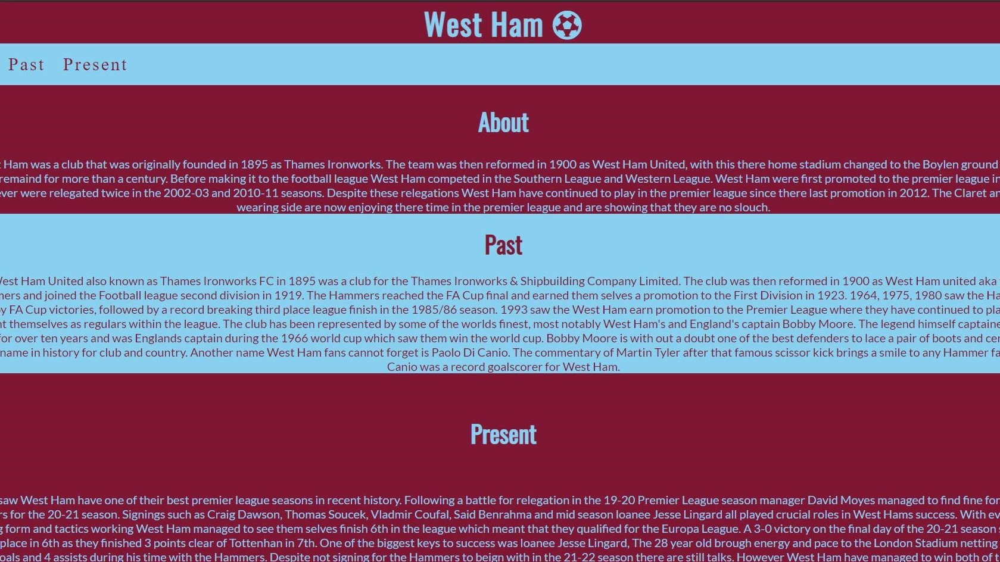
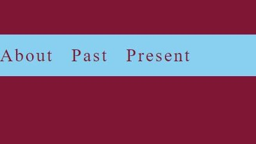

# Hammers History 
Hammers History is a site that helps Current West Ham fans or new West Ham fans understand more about the past of the club and also a bit of the present. The site is quite clearly aimed at supporters of West Ham United supporters, however thats not to say that outsiders to the sport cant have a look and read up on a football clubs history. So if you're someone who wants to learn more about a football clubs past and present or just polish your knowledge then the Hammers History page is definitely the site for you.

# Features

# Existing Features:

* The color scheme
  * One of the main features about the site is its color shceme. The claret and blue color scheme is a strong indicator that your are on a West Ham themed site. Any West Ham fan could spot the colors from a mile away.

 

 * The nav bar 
   * The nav bar is put in place to indicate each section of the page and clearly state what information will be on the page. 

   

   * ## The footer
     * All of the social media pages for the club will be located at the bottom of the page. 

     
