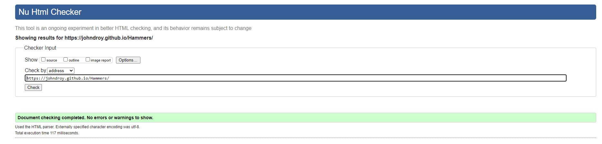
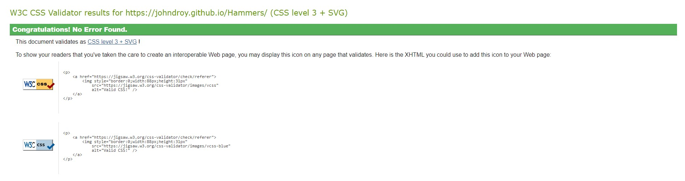

# Hammers History 
Hammers History is a site that helps Current West Ham fans or new West Ham fans understand more about the past of the club and also a bit of the present. The site is quite clearly aimed at supporters of West Ham United supporters, however thats not to say that outsiders to the sport cant have a look and read up on a football clubs history. So if you're someone who wants to learn more about a football clubs past and present or just polish your knowledge then the Hammers History page is definitely the site for you.

# Features

# Existing Features:

## The color scheme
  * One of the main features about the site is its color shceme. The claret and blue color scheme is a strong indicator that your are on a West Ham themed site. Any West Ham fan could spot the colors from a mile away.

 

 ## The nav bar 
 * The nav bar is put in place to indicate each section of the page and clearly state what information will be on the page. 

   

  ## The footer
  * All of the social media pages for the club will be located at the bottom of the page. 

     

     # Features to be added 
      * Images around the site displaying logos and team photos. 

      # Testing 
      * The main face of the website works as intended, the site has been tested on mulitple screen sizes and works fine. However media quiries may need to be added for if the screen size becomes too small. 
      * The site has been put through validation tests and has passed. 
      

      

      # Unfixed bugs
      * The site does not have any unfixed bugs that I am aware of. The site could do with a few things added to it to make it more interesting or responsive, however nothing appears to be broken or not working.

      # Deplyoment 
      * The site has been delpoyed onto git hub pages using these steps.
        * In the Github repository, go to the settings tab.
        * Head down to the pages section.
        * Select the branch drop down menu and change from none to main.
        * Click save and the site will be published with a link to the live website.

